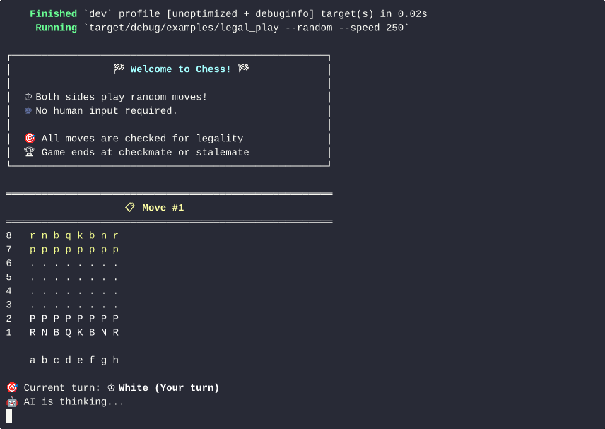
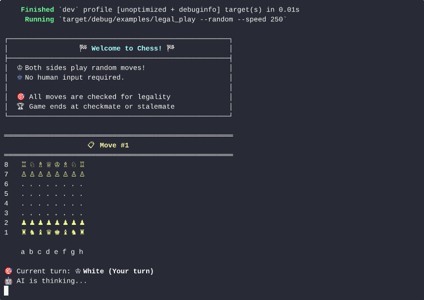

# Lumifox Chess Engine

## Overview

Lumifox is a personal attempt at creating a chess engine in Rust. The project is modular, with the core chess logic contained in the `lumifox_chess` crate.

## `lumifox_chess`

`lumifox_chess` is a high-performance, `#![no_std]` compatible chess library designed for correctness and speed. It provides a robust foundation for building chess engines, analysis tools, or any other chess-related application.

### Features

- **Bit board Representation**: Uses bit boards for an efficient representation of the board state.
- **Move Generation**: Fast and accurate legal move generation.
- **Legality Checking**: Verifies if moves are legal according to the rules of chess.
- **FEN Parsing**: Supports Forsyth-Edwards Notation (FEN) for setting up board positions.
- **Detailed Move Information**: Provides information about captures, promotions, en passant, and castling.

## Examples

The `lumifox_chess` crate comes with several examples to demonstrate its capabilities. You can run them using `cargo run --example <EXAMPLE_NAME>`.

### `legal_play`

An interactive chess game in your terminal. Play as White against a simple AI that makes random moves. This example showcases move validation, game state updates, and rendering the board.

**ASCII Version:**

```bash
PIECE_TYPE=ascii cargo run --example legal_play -F std
```



**Unicode Version:**

```bash
PIECE_TYPE=unicode cargo run --example legal_play -F std
```



### `attacked`

A tool to analyse a chess position from a FEN string. It identifies all pieces that are under attack and shows the specific moves that threaten them.

**Usage:**

```bash
cargo run --features std --example attacked "rnb1kbnr/pp1ppppp/8/2p5/4P3/5N2/PPPP1PPP/RNBQKB1R b KQkq - 1 2"
```

### `print`

A simple example that loads the starting position, generates all possible moves, prints a few of them, and then executes 10 random moves, displaying the board after each one.

**Usage:**

```bash
cargo run --features std --example print
```

## Licensing

This project uses multiple licences.

- The [`lumifox_chess`](./modules/chess) module is licensed under the LGPL-3.0-or-later.
- The [`lumifox_chess_proc`](./modules/proc/) module is licensed under the LGPL-3.0-or-later.
- The [`lumifox_uci`](./modules/uci/) module is licensed under the LGPL-3.0-or-later or BSD-3-Clause.

Please see the `LICENCE` files in the respective modules for more information.
